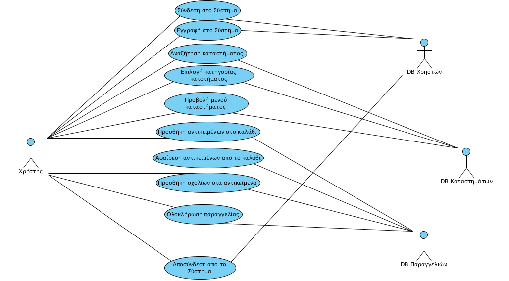

# Απαιτήσεις Χρηστών

## Λειτουργικές απαιτήσεις και Ιστορίες Χρηστών
(*στις περισσότερες ΛΑ υποθέτουμε ότι ο χρήστης έχει ήδη κάνει είσοδο στην υπηρεσία*)
### ΛΑ-1
Ο χρήστης πρέπει να μπορεί να κάνει είσοδο στην εφαρμογή (Login).

**Description**: Κάθε χρήστης θα έχει την δυνατότητα να συνδεθεί στην εφαρμογή όταν και όποτε επιθυμεί. Για να συνδεθεί στην εφαρμογή ο χρήστης θα πρέπει να πληκτρολογήσει το username και το password του, τα οποία θα τα έχει καταχωρίσει στον λογαριασμό του στην ΛΑ-3.

**User Priority** (5/5): Για τον χρήστη η συγκεκριμένη λειτουργία είναι πολύ σημαντική διότι με αυτόν τον τρόπο εξασφαλίζει την εξατομίκευση του λογαριασμού του και την εκτέλεση των παραγγελιών του.

**Technical difficulty** (2/5): Η λειτουργική αυτή απαίτηση δεν είναι ιδιαίτερα δύσκολη στην υλοποίηση καθώς υπάρχει αρκετά χρόνια για πολλές εφαρμογές και η τεχνογνωσία για αυτό είναι ευρέως γνωστή.

#### User story
[Login feature/story](https://github.com/esigalas/soft-eng-assignment/blob/master/requirements/login.feature)

### ΛΑ-2
Ο χρήστης πρέπει να μπορεί να κάνει έξοδο απο την εφαρμογή (Logout).

**Description**: Κάθε χρήστης που έχει συνδεθεί θα έχει την δυνατότητα να αποσυνδεθεί από την εφαρμογή όταν και όποτε επιθυμεί. Μόλις αποσυνδεθεί θα έχει δικαιώματα απλού επισκέπτη και δεν θα μπορεί να ολοκληρώσει μια παραγγελία.

**User Priority**(3/5): Για το χρήστη η συγκεκριμένη λειτουργία είναι σχετικά σημαντική, διότι σύνηθως θα βρίσκεται σε κάποιο προσωπικό του χώρο όταν θα θέλει να παραγγείλει. Γίνεται σημαντική όμως όταν βρίσκεται σε κάποιο ουδέτερο χώρο και θέλει να διαφυλάξει τα στοιχεία του.

**Technical difficulty**(2/5): Η λειτουργική αυτή απαίτηση δεν είναι ιδιαίτερα δύσκολη στην υλοποίηση για τους ίδιους λόγους που ισχύουν και στην ΛΑ-1

#### User story
[Logout feature/story](https://github.com/esigalas/soft-eng-assignment/blob/master/requirements/logout.feature)

### ΛΑ-3
Ο χρήστης πρέπει να μπορεί να κάνει εγγραφή στο σύστημα (Sign up).

**Description**: Κάθε χρήστης για να μπορεί να συνδεθεί στην εφαρμογή και να ολοκλήρώσει κάποια παραγγελία του θα πρέπει πρώτα να εγγραφεί στο σύστημα. Με αυτόν τον τρόπο θα δημιουργεί έναν λογαριασμό με όλα τα απαραίτητα στοιχεία του. Τα στοιχεία που θα πρέπει να συμπληρώσει είναι το όνομα, η διεύθυνση, το τηλέφωνο, το username και το password του. Ουσιαστικά το σύστημα θα διατηρεί μία βάση δεδομένων με τα στοιχεία που δίνονται απο τους χρήστες.

**User Priority**(5/5): Για τον χρήστη αυτή η λειτουργία είναι πολύ σημαντική γιατί αν δεν διεκπαιρεωθεί ο χρήστης δεν θα μπορεί να χρησιμοποιήσει την εφαρμογή.

**Technical difficulty**(2/5): Η λειτουργική αυτή απαίτηση δεν είναι ιδιαίτερα δύσκολη στην υλοποίηση για τους ίδιους λόγους που ισχύουν στις ΛΑ-1 και ΛΑ-2. 

#### User story
[Sign up feature/story](https://github.com/esigalas/soft-eng-assignment/blob/master/requirements/signup.feature)

### ΛΑ-4
Ο χρήστης πρέπει να μπορεί να επεξεργάζεται τα στοιχεία του.

**Description**: Κάθε χρήστης θα έχει την δυνατότητα να αλλάζει τα στοιχεία του (edit) έτσι ώστε να συμβαδίζουν με τα πραγματικά, όταν και όποτε αλλάζουν. Συνήθως οι αλλαγές αυτές σχετίζονται με την διεύθυνση και το τηλέφωνο.

**User Priority**(2/5): Για τον χρήστη αυτή η λειτουργία δεν είναι ιδιαίτερα σημαντική διότι οι περισσότεροι σπάνια αλλάζουν τα στοιχεία τους.

**Technical difficulty**(2/5): Αυτή η λειτουργική απαίτηση δεν είναι ιδιαίτερα δύσκολη στην υλοποίηση καθώς απλά θα εφαρμόζει μία αλλαγή στην βάση δεδομένων που διατηρεί το σύστημα για τα στοιχεία του πελάτη.
#### User story
[Edit feature/story](https://github.com/esigalas/soft-eng-assignment/blob/master/requirements/edit.feature)
### ΛΑ-5
Ο χρήστης πρέπει να μπορεί να επιλέξει γλώσσα.

**Description**: Κάθε χρήστης θα έχει την δυνατότητα να επιλέξει την γλώσσα που επιθυμεί ανάμεσα σε έναν αριθμό απο γλώσσες. Το περιεχόμενο της εφαρμογής θα εμφανίζεται στη γλώσσα που επιλέχτηκε απο τον χρήστη.

**User Priority**(4/5): Για τον χρήστη αυτή η λειτουργία είναι αρκετά σημαντική διότι του δίνει την δυνατότητα να επιλέξει να δει το περιεχόμενο της εφαρμογής στην γλώσσα που του είναι πιο οικεία. 

**Technical difficulty**(2/5): Αυτή η λειτουργική απαίτηση δεν είναι ιδιαίτερα δύσκολη στην υλοποίηση καθώς απλά θα γίνει μία μετάφραση στο κείμενο που υπάρχει στην εφαρμογή.

#### User story
[Language feature/story](https://github.com/esigalas/soft-eng-assignment/blob/master/requirements/language.feature)

### ΛΑ-6
Ο χρήστης πρέπει να μπορεί να επιλέγει τρόπο πληρωμής.

**Description**: Κάθε χρήστης θα έχει την δυνατότητα να επιλέξει τον τρόπο με τον οποίο θέλει να πληρώσει πριν ολοκληρώσει την παραγγελία του.

**User Priority**(3/5): Για τον χρήστη αυτή η λειτουργία είναι σημαντική διότι του δίνει την ελευθερία να επιλέξει τον τρόπο πληρωμής που τον βολεύει περισσότερο. 

**Technical difficulty**(2/5): Αυτή η λειτουργική απαίτηση δεν είναι ιδιαίτερα δύσκολη στην υλοποίηση καθώς απλά θα εμφανίζεται μία λίστα με επιλογές πληρωμής για να επιλέξει ο χρήστης.

#### User story
[Payment feature/story](https://github.com/esigalas/soft-eng-assignment/blob/master/requirements/payment.feature)

### ΛΑ-7
Ο χρήστης πρέπει να μπορεί να προσθέτει περισσότερες από μία διευθύνσεις.

**Description**: Κάθε χρήστης θα έχει την δυνατότητα να προσθέσει και άλλες διευθύνσεις στον λογαριασμό του και να επιλέγει κάθε φορά που παραγγέλνει σε ποια διεύθυνση επιθυμέι να γίνει η παράδοση της παραγγελίας.

**User Priority**(5/5): Για τον χρήστη αυτή η λειτουργία είναι πολύ σημαντική διότι του δίνει την δυνατότητα να χρησιμοποιήσει τον λογαριασμό του από οποιοδήποτε χώρο και όχι μόνο από την κατοικία του.

**Technical difficulty**(2/5): Αυτή η λειτουργική απαίτηση δεν είναι ιδιαίτερα δύσκολη στην υλοποίηση καθώς απλά θα γίνεται μία πρόσθεση στα στοιχεία του χρήστη που υπάρχουν στη βάση που διατηρεί το σύστημα.

#### User story
[Address feature/story](https://github.com/esigalas/soft-eng-assignment/blob/master/requirements/address.feature)

### ΛΑ-8
Ο χρήστης πρέπει να μπορεί να κάνει αναζήτηση καταστημάτων.

**Description**: Κάθε χρήστης θα έχει την δυνατότητα να αναζητά ένα συγκεκριμένο κατάστημα της επιλογής του, το οποίο γνωρίζει εκ των προτέρων και βρίσκεται ψηλά στις προτιμήσεις του. Σκοπός αυτής της λειτουργίας είναι λοιπόν να μπορεί να βρίσκει γρήγορα και εύκολα αυτά τα καταστήματα.

**User Priority**(4/5): Για τον χρήστη αυτή η λειτουργία είναι αρκετά σημαντική διότι του κερδίζει χρόνο όταν θέλει να παραγγείλει από κάποιο συγκεκριμένο κατάστημα. 

**Technical difficulty**(4/5): Αυτή η λειτουργική απαίτηση έχει αρκετή δυσκολία γιατί πρέπει να διατηρείται μία βάση δεδομένων που να περιέχει τα καταστήματα που θα μπορεί να παραγγείλει ο  χρήστης. Επίσης θα πρέπει να δημιουργηθεί μία μηχανή αναζήτησης που θα κάνει αξιόπιστη αναζήτηση στην υπάρχουσα βάση για να επιστρέψει τα καταστήματα που ψάχνει ο χρήστης. Η τεχνογνωσία αυτή είναι γνωστή αλλά λαμβάνοντας υπόψη πως αυτή η βάση θα πρέπει και να ανανεώνεται με νέα καταστήματα που ανοίγουν ή με καταστήματα που κλείνουν αυξάνεται περισσότερο ο βαθμός δυσκολίας.

#### User story
[Search feature/story](https://github.com/esigalas/soft-eng-assignment/blob/master/requirements/search.feature)

### ΛΑ-9
Ο χρήστης πρέπει να μπορεί να επιλέγει κατηγορίες καταστημάτων.

**Description**: Κάθε χρήστης θα έχει την δυνατότητα να επιλέγει την κατηγορία αυτή που επιθυμεί, ανάλογα με το τι επιθυμεί να φάει. Οι κατηγορίες χωρίζονται, ανάλογα με την κουζίνα, σε καταστήματα με burger, pizza , γύρο, σουβλάκι, grill-ψητά , κρέπες, τοστ, γλυκά, sushi, μαγειρευτά, νηστίσιμα, μεξικάνικο, ινδικό, κινέζικο, μακαρονάδες, βάφλες, καφέ, 24ώρο κ.α.

**User Priority**(5/5): Για τον χρήστη αυτή η λειτουργία είναι πολύ σημαντική διότι του δίνει μια πληθώρα επιλογών για να ικανοποιήσει την όρεξη του ανάλογα.

**Technical difficulty**(3/5): Σε αυτή τη λειτουργική απαίτηση απλά θα εφαρμόζονται κάποια φίλτρα στα καταστήματα που θα βλέπει ο χρήστης, κάτι το οποίο είναι μέτριας δυσκολίας.

#### User story
[Pick category feature/story](https://github.com/esigalas/soft-eng-assignment/blob/master/requirements/PickCategory.feature)

### ΛΑ-10
Ο χρήστης πρέπει να μπορεί να ταξινομεί τα καταστήματα.

**Description**: Κάθε χρήστης θα έχει την δυνατότητα να επιλέγει τον τρόπο ταξινόμησης των καταστημάτων ανάλογα με το κόστος ελάχιστης παραγγελίας, τον εκτιμώμενο χρόνο παράδοσης της παραγγελίας και τις αξιολογήσεις άλλων χρηστών.

**User Priority**(5/5): Για τον χρήστη αυτή η λειτουργία είναι πολύ σημαντική διότι με βάση τα παραπάνω κριτήρια μπορεί να επιλέξει το κατάλληλο κατάστημα που θα τον ικανοποιήσει στο κομμάτι εκείνο που επιθυμεί περισσότερο. 

**Technical difficulty**(3/5): Σε αυτή τη λειτουργική απαίτηση απλά θα γίνεται κάποια ταξινόμηση των καταστημάτων κάτι το οποίο είναι μέτριας δυσκολίας.

#### User story
[Sort feature/story](https://github.com/esigalas/soft-eng-assignment/blob/master/requirements/Sort.feature)

### ΛΑ-11
Ο χρήστης πρέπει να μπορεί να βλέπει το μενού του κάθε καταστήματος.

**Description**: Κάθε χρήστης επιλέγοντας κάποιο κατάστημα θα μπορεί να βλέπει τα διάφορα προϊόντα που διαθέτει αυτό το κατάστημα καθώς και τις τιμές τους.

**User Priority**(5/5): Αυτή η λειτουργία είναι πολύ σημαντική για τον χρήστη γιατί αν δεν μπορεί να δει τα προϊόντα των καταστημάτων δεν θα μπορεί να ολοκληρώρει κάποια παραγγελία

**Technical difficulty**(2/5): Αυτή τη λειτουργική απαίτηση δεν είναι ιδιαίτερα δύσκολη στην υλοποίηση καθώς το να εμφανιστεί στο χρήστη μία λίστα επιλογών είναι κάτι απλό.

#### User story
[Menu feature/story](https://github.com/esigalas/soft-eng-assignment/blob/master/requirements/menu.feature)

### ΛΑ-12
Ο χρήστης πρέπει να μπορεί να βλέπει τις πληροφορίες του κάθε καταστήματος. 

**Description**: Κάθε χρήστης θα έχει την δυνατότητα να βλέπει τις πληροφορίες του κάθε καταστήματος, όπως είναι το ωράριο του καταστήματος και ημέρες λειτουργίας του, για να μπορεί να προγραμματίσει καλύτερα την παραγγελία του. Επίσης θα βλέπει την τοποθεσία του καταστήματος και θα έχει μια εκτίμηση της απόστασης που έχει το κατάστημα από τον τόπο παράδοσης. Θα μπορεί επίσης να βλέπει σε ένα χάρτη και την εύρος παράδοσης του κάθε μαγαζιού.

**User Priority**(5/5): Αυτή η λειτουργία είναι πολύ σημαντική για τον χρήστη γιατί όλες οι πληροφορίες που λαμβάνει είναι σημαντικές για την απόφαση του κατά την επιλογή ενός καταστήματος.

**Technical difficulty**(2/5):Αυτή τη λειτουργική απαίτηση δεν είναι ιδιαίτερα δύσκολη στην υλοποίηση καθώς η εμφάνιση πληροφοριών στον χρήστη είναι κάτι απλό όπως και στην ΛΑ-11.

#### User story
[Info feature/story](https://github.com/esigalas/soft-eng-assignment/blob/master/requirements/info.feature)

### ΛΑ-13
Ο χρήστης πρέπει να μπορεί να βλέπει τις αξιολογήσεις του κάθε καταστήματος.

**Description**: Κάθε χρήστης θα έχει τη δυνατότητα να βλέπει το πως έχουν αξιολογήσει άλλοι χρήστες κάποιο κατάστημα, καθώς και διάφορα σχόλια αυτών των χρηστών για το κατάστημα. Ο χρήστης επίσης θα βλέπει και έναν μέσο όρο των αξιολογήσεων απο όλους τους χρήστες για κάποιο κατάστημα.

**User Priority**(4/5): Αυτή η λειτουργία είναι σχετικά σημαντική για το ποιό κατάστημα θα επιλέξει ο χρήστης να κάνει την παραγγελία. Σε κάποιες περιπτώσεις που θα υπάρχει αρνητική αξιολόγηση μπορεί να αποτρέψει τον χρήστη να παραγγείλει από το συγκεκριμένο κατάστημα.

**Technical difficulty**(2/5): Αυτή τη λειτουργική απαίτηση δεν είναι ιδιαίτερα δύσκολη στην υλοποίηση καθώς απλά θα εμφανίζονται στον χρήστη σχόλια που έχουν γίνει απο άλλους χρήστες και η αξιολόγηση τους για κάποιο συγκεκριμένο κατάστημα.

#### User story
[SeeEvaluation feature/story](https://github.com/esigalas/soft-eng-assignment/blob/master/requirements/SeeEvaluation.feature)

### ΛΑ-14
Ο χρήστης πρέπει να μπορεί να αξιολογεί τα καταστήματα.

**Description**: Κάθε χρήστης θα έχει τη δυνατότητα να αξιολογεί τα καταστήματα από τα οποία έχει παραγγείλει επιλέγοντας μια βαθμολογία. Επίσης θα μπορεί να αφήνει κάποιο σχόλιο για τις εντυπώσεις του από το φαγητό και την εξυπηρέτηση που είχε.

**User Priority**(1/5): Αυτή η λειτουργία δεν είναι σημαντική για τον χρήστη γιατί δεν είναι απαραίτητη για να ολοκληρώσει μια παραγγελία, ειναι προαιρετική μετά την παράγγελία και ελάχιστοι είναι αυτοί που θα ξοδέψουν χρόνο για να σχολιάσουν πως ήταν μια παραγγελία του, εκτός εάν είναι κάτι ιδιαίτερα καλό ή κακό.

**Technical difficulty**(3/5): Αυτή τη λειτουργική απαίτηση είναι μέτριας δυσκολίας καθώς απλά θα αποθηκεύεται στην βάση δεδομένων για τα καταστήματα η βαθμολογία του χρήστη.σ

#### User story
[Evaluation feature/story](https://github.com/esigalas/soft-eng-assignment/blob/master/requirements/Evaluation.feature)

### ΛΑ-15
Ο χρήστης πρέπει να μπορεί να βλέπει τις παραγγελίες που έχει κανει σε κάθε κατάστημα.

**Description**: Κάθε χρήστης θα έχει τη δυνατότητα να βλέπει στην σελίδα του κάθε καταστήματος τις τελευταίες 10 παραγγελίες του και να βλέπει έτσι ποιες ήταν οι προτιμήσεις του για το συγκεκριμένο κατάστημα.

**User Priority** (5/5): Αυτή η λειτουργία είναι πολύ σημαντική για τον χρήστη γιατί οι προτιμήσεις συνήθως επαναλαμβάνονται οπότε έχει μια ξεκάθαρη εικόνα του τι ακριβώς είχε παραγγείλει από το συγκεκριμένο κατάστημα οπότε διαμορφώνει ανάλογα και την επόμενη παραγγελία του από αυτό το κατάστημα.

**Technical difficulty**(3/5): Αυτή τη λειτουργική απαίτηση είναι μέτριας δυσκολίας καθώς θα πρέπει το σύστημα να διατηρεί ένα ιστορικό για τις παραγελίες σε κάθε κατάστημα για όλους τους χρήστες.

#### User story
[Orders feature/story](https://github.com/esigalas/soft-eng-assignment/blob/master/requirements/Orders.feature)

### ΛΑ-16
Ο χρήστης πρέπει να μπορεί να προσθέσει κατάστημα στα αγαπημένα του.

**Description**: Κάθε χρήστης θα έχει τη δυνατότητα τα καταστήματα τα οποία είναι ψηλά στις προτιμήσεις του και τον βολεύουν τις περισσότερες φορές που παραγγέλνει, να μπαίνουν σε μια λίστα που θα ονομάζεται "αγαπημένα" για να μπορεί γρήγορα και εύκολα να τα βρίσκει και να προχωράει την παραγγελία του σε ένα από αυτά τα καταστήματα.

**User Priority**(5/5): Αυτή η λειτουργία είναι πολύ σημαντική για τον χρήστη γιατί όταν έχει βρει ένα καταστήμα που τον βολεύει συνήθως δύσκολα επιλέγει να δοκιμάσει άλλο. Με αυτό τον τρόπο έχει σε μια λίστα όλα εκείνα τα καταστήματα που είναι ψηλά στις προτιμήσεις του και είναι το πιθανότερο να παραγγείλει από αυτά.

**Technical difficulty**(3/5): Αυτή τη λειτουργική απαίτηση είναι μέτριας δυσκολίας καθώς θα πρέπει το σύστημα να διατηρεί σε μία βάση δεδομένων τα καταστήματα που επιλέγει ο χρήστης ως αγαπημένα.

#### User story
[AddToFavorites feature/story](https://github.com/esigalas/soft-eng-assignment/blob/master/requirements/AddToFavorites.feature)

### ΛΑ-17
Ο χρήστης θα πρέπει να μπορεί να βλέπει τα αγαπημένα του καταστήματα.

**Description**: Κάθε χρήστης βλέποντας συγκεντρωμένα όλα τα αγαπημένα του καταστήματα θα μπορεί πιο εύκολα να αποφασίσει απο που να παραγγείλει.

**User Priority**(5/5): Αυτή η λειτουργία είναι πολύ σημαντική για τον χρήστη για τους ίδιους λόγους που ισχύουν και για την ΛΑ-16.

**Technical difficulty**(2/5): Αυτή η λειτουργική απαίτηση δεν είναι ιδιαίτερα δύσκολη στην υλοποίηση γιατί η εμφάνιση πληροφορίας στον χρήστη είναι κάτι απλό.

#### User story
[SeeFavorites feature/story](https://github.com/esigalas/soft-eng-assignment/blob/master/requirements/SeeFavorites.feature)

### ΛΑ-18
Ο χρήστης θα μπορεί να βλέπει τις τελευταίες παραγγελίες του.

**Description**: Κάθε χρήστης θα έχει τη δυνατότητα να βλέπει στην αρχική σελίδα του τις 5 τελευταίες παραγγελίες που [ραγματοποίησε με την εφαρμογή και να βλέπει ποιες ήταν οι προτιμήσεις του.

**User Priority**(5/5): Αυτή η λειτουργία είναι πολύ σημαντική για τον χρήστη γιατί οι προτιμήσεις συνήθως επαναλαμβάνονται οπότε έχει μια ξεκάθαρη εικόνα του τι ακριβώς είχε παραγγείλει, και από ποιο κατάστημα, για να μπορέσει να το ξανά-παραγγείλει.

**Technical difficulty**(3/5): Αυτή τη λειτουργική απαίτηση είναι μέτριας δυσκολίας καθώς θα πρέπει το σύστημα να διατηρεί σε μία βάση δεδομένων τις τελευταίες παραγγελίες του κάθε χρήστη.

#### User story
[ feature/story]()

### ΛΑ-19
Ο χρήστης θα πρεπει να ενημερώνεται όταν υπάρχει προσφορά παραγγελίας σε κάποιο από τα καταστήματα.

**Description**: Κάθε χρήστης θα έχει τη δυνατότητα να βλέπει στην αρχική σελίδα ποια καταστήματα έχουν προσφορά για την συγκεκριμένη μέρα και να διαμορφώνει ανάλογα την παραγγελία του.

**User Priority** (3/5): Αυτή η λειτουργία είναι σχετικά σημαντική για τον χρήστη γιατί μπορεί να βγάλει προσφορά κάποιο από τα καταστήματα που τον ενδιαφέρουν και να προχώρησει σε παραγγελία με κέρδος για εκείνη την μέρα.

**Technical difficulty**(3/5): Αυτή η λειτουργία είναι μέτριας δυσκολίας καθώς το να ενημερώνεται το σύστημα κάθε μέρα για τις προσφορές των καταστημάτων δεν είναι τόσο απλό.

#### User story
[ feature/story]()

### ΛΑ-20
Ο χρήστης θα πρέπει να έχει ένα καλάθι αγορών.

**Description**: Κάθε χρήστης αφού επιλέξει κάποιο κατάστημα για να παραγγείλει θα του παρέχεται ταυτόχρονα και ένα καλάθι αγορών για να προσθέσει τα προϊόντα που θέλει.

**User Priority**(5/5): Αυτή η λειτουργία είναι πολύ σημαντική για τον χρήστη γιατί θα μπορεί να βλέπει συγκεντρωμένα τα προϊόντα που έχει επιλέξει.

**Technical difficulty**(3/5): Αυτή η λειτουργία είναι μέτριας δυσκολίας καθώς θα πρέπει να υπάρχει μία δομή δεδομένων που θα της προσθέτονται οι επιλογές του χρήστη.

#### User story
[ feature/story]()

### ΛΑ-21
Ο χρήστης πρέπει να μπορεί προσθέτει αντικείμενα στο καλάθι.

**Description**: Κάθε χρήστης θα μπορεί επιλέγοντας κάποιο προϊόν απο το μενού κάποιου καταστήματος να το προσθέσει στο καλάθι του.

**User Priority**(5/5): Αυτή η λειτουργία είναι πολύ σημαντική για τον χρήστη γιατί χωρίς αυτή δεν θα μπορούσε να ολοκληρώσει την παραγγελία του. 

**Technical difficulty**(3/5): Αυτή η λειτουργία είναι μέτριας δυσκολίας καθώς απλα θα γίνεται μία προσθήκη στην δομή δεδομένων που αναφέρθηκε στη ΛΑ-20.

#### User story
[ feature/story]()

### ΛΑ-22
Ο χρήστης πρέπει να μπορεί να αφαιρεί αντικείμενα απο το καλάθι.

**Description**: Κάποιος χρήστης μπορεί να αλλάξει γνώμη για κάποιον προϊόν που πρόσθεσε στο καλάθι του, για αυτό το λόγω θα πρέπει να μπορεί να αφαιρεί αυτό το προϊόν. 

**User Priority**(5/5): Αυτή η λειτουργία είναι πολύ σημαντική για τον χρήστη στην περίπτωση που προσθέσει κάποιο προϊόν κατα λάθος στο καλάθι της παραγγελίας του.

**Technical difficulty**(3/5): Αυτή η λειτουργία είναι μέτριας δυσκολίας καθώς απλα θα γίνεται μία αφαίρεση απο τη δομή δεδομένων που αναφέρθηκε στη ΛΑ-20.

#### User story
[ feature/story]()

### ΛΑ-23
Ο χρήστης πρέπει να μπορεί προσθέτει σχόλιο σε κάθε προϊόν.

**Description**: Κάθε χρήστης όταν επιλέγει να προσθέσει κάποιο προϊόν στο καλάθι παραγγελίας θα μπορεί να γράψει και κάποιο σχόλιο για αυτό το προϊόν.

**User Priority**(4/5): Αυτή η λειτουργία είναι σημαντική στην περίπτωση που κάποιος χρήστης επιθυμεί να αφαιρέσει κάποιο απο τα προεπιλεγμένα υλικά κάποιου φαγητού.

**Technical difficulty**(2/5): Αυτή η λειτουργία δεν έχει κάποια ιδιαίτερη δυσκολία καθώς απλά θα προστίθεται κάποιο κείμενο που έχει γράψει ο χρήστης σε ένα προϊόν.

#### User story
[ feature/story]()

### ΛΑ-24
Ο χρήστης πρέπει να μπορεί να ολοκληρώσει την παραγγελία του.

**Description**: Κάθε χρήστης αφού έχει προσθέσει προϊόντα στο καλάθι της παραγγελίας του θα μπορεί να ολοκληρώσει την παραγγελία του.

**User Priority**(5/5): Αυτή είναι πολύ σημαντική λειτουργία καθώς με αυτή ο χρήστης επιτυγχάνει τελικά τον στόχο του για τον οποίο χρησιμοποίησε την εφαρμογή.

**Technical difficulty**(4/5): Αυτή η λειτουργία πρέπει να είναι αξιόπιστη για τον έλεγχο και την αποστολή της παραγγελίας κάτι το οποίο δεν είναι εύκολο.

#### User story
[ feature/story]()

### ΛΑ-25
Το σύστημα πρέπει να εμφανίζει μήνυμα επιτυχίας/αποτυχίας μετά την ολοκλήρωση της παραγγελίας.

**Description**: Μετά την ολοκλήρωση της παραγγελίας του ο χρήστης θα μπορεί να δει με τη μορφή μηνύματος το αποτέλεσμα της ολοκλήρωσης της παραγγελίας του.

**User Priority**(5/5): Αυτή η λειτουργία είναι πολύ σημαντική γιατί ενημερώνει το χρήστη για την έκβαση της παραγγελίας του, οπότε αυτός ξέρει αν χρειάζεται να την επαναλάβει ή όχι.

**Technical difficulty**(2/5): Αυτή η λειτουργία δεν είναι ιδιαίτερα δύσκολη γιατί απλά θα εμφανίζει κάποιον μήνυμα στον χρήστη.

#### User story
[ feature/story]()

## Use case diagram

Representation of all users and user stories/use cases

## Activity diagrams

####Activity Diagram Αρχικής Σελίδας

####Activity Diagram Βασικής Σελίδας

####Activity Diagram Παραγγελίας

####Activity Diagram Σελίδας Λογαριασμού Χρήστη

####Activity Diagram Σελίδας Καταστήματος

## Mockups and Storyboards

Put the link to the relevant storyboard.md files that display how one goes from one mockup to another.

## Μη Λειτουργικές απαιτήσεις

### ΜΛΑ-1
Το σύστημα πρέπει να μπορεί να λειτουργεί σε Android, Ios, WindowsPhone.

**Description**: Τα τελευταία χρόνια τα λειτουργικά συστήματα για κινητά έχουν εξελιχθεί ραγδαία. Η εφαρμογή για να την χρησιμοποιούν πολλοί χρήστες θα πρέπει να είναι συμβατή και με τους τρεις δημοφιλέστερους τύπους λειτουργικών συστημάτων. 

**User Priority**(5/5): Αυτή η λειτουργία είναι πολύ σημαντική για τον χρήστη γιατί θα θέλει να μπορεί να λειτουργεί την εφαρμογή σε οποιοδήποτε λειτουργικό σύστημα χρησιμοποιεί  χωρίς προβλήματα.

**Technical difficulty**(4/5): Αυτή η μη λειτουργική απαίτηση είναι ιδιαίτερα απαιτητική. Να δουλεύει μία εφαρμογή με την ίδια ακριβώς αξιοπιστία σε όλα τα λειτουργικά συστήματα είναι κάτι δύσκολο και οφείλεται στον τρόπο δημιουργίας εφαρμογών για το εκάστοτε λειτουργικό.

### ΜΛΑ-2
Το σύστημα πρέπει να μπορεί να ανταποκρίνεται στις ενέργειες του χρήστη σε χρόνο μικρότερου των 3 δευτερολέπτων.

**Description**: Όταν κάποιος χρήστης θα επιλέγει κάποια εντολή του συστήματος το σύστημα θα πρέπει να την ολοκληρώνει σε χρόνο μικρότερο των τριών δευτερολέπτων.

**User Priority**(4/5): Η γρήγορη απόκριση του συστήματος στις επιλογές του χρήστη βελτιώνει την εμπειρία χρήσης του και τον ενθαρρύνει να χρησιμοποιεί την εφαρμογή. 

**Technical difficulty**(4/5): Αυτή η μη λειτουργική απαίτηση είναι σχετικά δύσκολη στην υλοποίηση της και εξαρτάται πολύ και απο τα χαρακτηριστικά της συσκευής που είναι εγκατεστημένη η εφαρμογή.

### ΜΛΑ-3
Το σύστημα πρέπει να έχει πιθανότητα μη διαθεσιμότητας μικρότερη του 2%.

**Description**: Το σύστημα θα πρέπει να είναι διαθέσιμο για να το χρησιμοποιήσει ο χρήστης περισσότερες απο 98 στις 100 φορές. Δηλαδή ο server του συστηματος θα πρέπει να είναι σε λειτουργία σχεδόν συνέχεια.

**User Priority**(5/5): Η διαθεσιμότητα του συστήματος είναι πολύ σημαντική για την αντιμετωπιση και τη συχνότητα χρήσης της εφαρμογής απο τον χρήστη.

**Technical difficulty**(4/5): Αυτή η μη λειτουργική απαίτηση είναι αρκετά δύσκολο να επιτευχθεί σε τόσο μεγάλο ποσοστό.

### ΜΛΑ-4
Το σύστημα πρέπει να παρέχει ένα φιλικό προς τον χρήστη περιβάλλον.

**Description**: Η εφαρμογή αναφέρεται σε άτομα όλων των ηλικιών για αυτό το λόγο θα πρέπει να είναι εύκολα κατανοητή απο όλους. Το γραφικό περιβάλλον δηλαδή θα πρέπει να πληροί αυτή την προδιαγραφή.

**User Priority**(4/5): Για κάθε χρήστη είναι σημαντικό μία εφαρμογή να είναι εύκολη στη χρήση έτσι ώστε να μην καταναλώσει πολύ χρόνο για την κατανόηση της.

**Technical difficulty**(3/5): Το να δημιουργηθεί ένα περιβάλλον φιλικό για τον χρήστη δεν είναι κάτι που μπορεί να υλοποιηθεί εύκολα. Υπάρχουν αρκετά χρόνια εμπειρίας όμως σε γραφικά περιβάλλοντα εφαρμογών που μπορούν να βοηθήσουν στην υλοποίηση αυτή της μη λειτουργικής απαίτησης.

### ΜΛΑ-5
Το σύστημα πρέπει να περιλαμβάνει το 99% των καταστημάτων της πόλης που κάνουν delivery.

**Description**: Ο χρήστης χρησιμοποιώντας την εφαρμογή για να κάνει μία παραγγελία θα πρέπει να διαθέτει ένα μεγάλο εύρος καταστημάτων για να επιλέξει.

**User Priority**(4/5): Αυτή η λειτουργία είναι πολύ σημαντική για δίνει στον χρήστη τη δυνατότητα μεγάλου πλήθους επιλογών.

**Technical difficulty**(3/5): Αυτή η μη λειτουργική απαίτηση είναι μέτριας δυσκολίας καθώς πρέπει να βρεθούν πληροφορίες για έναν μεγάλο αριθμό καταστημάτων που κάνουν delivery σε κάθε πόλη.

### ΜΛΑ-6
Τα στοιχεία των χρηστών θα πρέπει να εισάγονται κρυπτογραφημένα στη βάση δεδομένων.

**Description**: Επειδή θα δίνεται η δυνατότητα στον χρήστη να πληρώνει μέσω κάρτας, είναι σημαντικό να μπορεί διαφυλάξει τα στοιχεία του από πιθανό κίνδυνο έκθεσης. Για αυτό το σύστημα θα πρέπει να παρέχει την κατάλληλη ασφάλεια για να μειώσει αυτόν τον κίνδυνο.

**User Priority**(5/5): Είναι πολύ σημαντικό για τους χρήστες να νιώθουν ότι τα στοιχεία τους προφυλάσσονται από εξωτερικούς κινδύνους, ειδικά για εκείνους που χρησιμοποιούν στις αγορές τους κάρτα. 

**Technical difficulty**(4/5): Το πώς θα γίνεται σωστά η κρυπτογράφηση των στοιχείων του κάθε χρήστη είναι ένα αρκετά δύσκολο πρόβλημα κυρίως όσο αναφορά τον τρόπο της κρυπτογράφησης.

### ΜΛΑ-7
Το σύστημα πρέπει να εμφανίζει δύο τρόπους πληρωμής στον χρήστη, με μετρητά ή κάρτα.

**Description**: Ο χρήστης πριν την ολοκλήρωση της παραγγελίας του θα μπορεί να επιλέξει να πληρώσει με κάρτα ή με μετρητά.

**User Priority**(2/5): Αυτή  λειτουργία δεν είναι πολύ σημαντική γιατί οι περισσότεροι χρήστες χρησιμοποιούν μετρητά για την παραγγελία τους.

**Technical difficulty**(4/5): Αυτή η μη λειτουργική απαίτηση είναι δύσκολη στην περίπτωση της πληρωμής με κάρτα καθώς θα πρέπει να εκτελείται ένα αίτημα για μία ηλεκτρονική τραπεζική συναλλαγή.

### ΜΛΑ-8
Η αναζήτηση των καταστημάτων θα γίνεται με μία μηχανή αναζήτησης.

**Description**: Κατά τα πρότυπα της google, το σύστημα θα παρέχει στον χρήστη μια αντίστοιχη μηχανή αναζήτησης στην αρχική του σέλιδα για να μπορεί να αναζητά γρήγορα και εύκολα τα καταστήματα που θέλει ο χρήστης.

**User Priority**(4/5):Για τον χρήστη αυτή η λειτουργία είναι αρκετά σημαντική διότι του κερδίζει χρόνο όταν θέλει να παραγγείλει από κάποιο συγκεκριμένο κατάστημα.

**Technical difficulty**(4/5): Η δημιουργία μία αξιόπιστης μηχανής αναζήτησης δεν είναι απλό πρόβλημα και θα πρέπει να ληφθούν υπόψη αρκετοί παράμετροι όπως αναφέρθηκαν στην ΛΑ-8.

### ΜΛΑ-9
Η ταξινόμηση των καταστημάτων από τον χρήστη θα μπορεί να γίνει με βάση το κόστος, τον χρόνο, τον μέσο όρο αξιολόγησης και την απόσταση.

**Description**: Ανάλογα τις προτιμήσεις του χρήστη, θα μπορεί να ταξινόμεί τα καταστήματα είτε με βάση το κόστος ελάχιστης παραγγελίας, είτε με τον ελάχιστον χρόνο που θέλει ένα κατάστημα να παραδώσει την παραγγελία, είτε με την απόσταση του τόπου παράδοσης από το κατάστημα είτε από το εαν έχει ψηλές ή χαμηλές αξιολογήσεις. 

**User Priority**(5/5): Για τον χρήστη αυτή η λειτουργία είναι πολύ σημαντική διότι με βάση τα παραπάνω κριτήρια μπορεί να επιλέξει το κατάλληλο κατάστημα που θα τον ικανοποιήσει στο κομμάτι εκείνο που επιθυμεί περισσότερο. 

**Technical difficulty**(3/5): Η ταξινόμηση ανάλογα με κάποια μεταβλητή που ορίζει ο χρήστης είναι μία μη λειτουργική απίτηση μέτριας δυσκολίας.

### ΜΛΑ-10
Η αξιολόγηση των καταστημάτων θα γίνεται με αστέρια.

**Description**: Ύστερα από κάθε παραγγελία θα δίνεται η δυνατότητα στον χρήστη να αξιολογεί το κατάστημα από το οποίο παρήγγειλε με ένα γρήγορα σύστημα αξιολόγης επιλογής από 1 εώς 5 αστέρια. 

**User Priority**(1/5): Για τον χρήστη η λειτουργία αυτή δεν είναι σημαντική καθώς δεν επηρεάζει την διαδικασία της παραγγέλιας του. 

**Technical difficulty**(2/5): Αυτή η μη λειτουργική απαίτηση είναι σχετικά απλή στην υλοποίηση καθώς απλά θα εμφανίζονται κάποια αστέρια και τα οποία θα επιλέγει ο χρήστης ανάλογα με την αξιολόγηση που θέλει να κάνει.

### ΜΛΑ-11
Το σύστημα πρέπει να εφαρμόζει σωστά τα φίλτρα που επιλέγει ο χρήστης.

**Description**: Θέλουμε το σύστημα να παρουσιάζει ακριβώς αυτό που φιλτράρει ο χρήστης, δηλαδή όταν θα επιθυμεί να δει πχ τις πιτσαρίες να έχει γίνει σωστά η κατηγοριοποίηση των καταστημάτων και να μην παρουσιαστούν άλλου τύπου καταστήματα σε αυτό το φίλτρο.

**User Priority**(4/5): Είναι αρκετά σημαντικό για τον χρήστη να παίρνει αξιόπιστα αποτελέσματα από το φιλτράρισμα που επιλέγει έτσι ώστε να συνεχίσει να προτιμά την εφαρμογή μας.

**Technical difficulty**(3/5): Η εφαρμογή των φίλτρων που θα επιλέγει ο χρήστης είναι μία μη λειτουργική απαίτηση μέτριας δυσκολίας.

### ΜΛΑ-12
Το σύστημα πρέπει να εμφανίζει τις προσφορές ως pop-up παράθυρο.

**Description**: Στην αρχική σελίδα κάθε χρήστη, με το που θα φορτώνει η σελίδα, θα εμφανίζεται ένα pop-up παράθυρο με τις σημερινές προσφορές από διάφορα καταστήματα.

**User Priority**(2/5): Για τον χρήστη η λειτουργία αυτή δεν ιδιαίτερα σημαντική διότι θα πρέπει ταυτόχρονα να βγάλει προσφορά ένα από τα μαγαζιά που γνωρίζει και προτιμά την ημέρα εκείνη που επιθυμεί να κάνει παραγγελία ο χρήστης.

**Technical difficulty**(3/5): Η εμφάνιση ένος pop-up παραθύρου το όποίο θα λειτουργεί αξιόπιστα τις περισσότερες φορές είναι μία μη λειτουργική απαίτηση μέτριας δυσκολίας. 

### ΜΛΑ-13
Το σύστημα πρέπει να περιορίζει τον χρήστη στο να προσθέτει αντικείμενα μόνο από ένα κατάστημα. 

**Description**: Για να ολοκληρωθεί μία παραγγελία πρέπει όλα τα προϊόντα που έχει επιλέξει ο χρήστης να προέρχονται από ένα μόνο κατάστημα.

**User Priority**(2/5): Για τον χρήστη αυτή η λειτουργία δεν είνα ιδιαίτερα σημαντική καθώς ο στόχος του είναι να εκτελέσει κάποια παραγελία και όχι να ελέγξει απο που προέρχονται τα προϊόντα που θα παραγείλει.

**Technical difficulty**(2/5): Αυτή η μη λειτουργική απαίτηση δεν είναι ιδιάιτερα δύσκολη στην υλοποίηση καθώς απλά θα γίενται ένας συσχετισμός
του καλαθιού αγορών με ένα κατάστημα.
