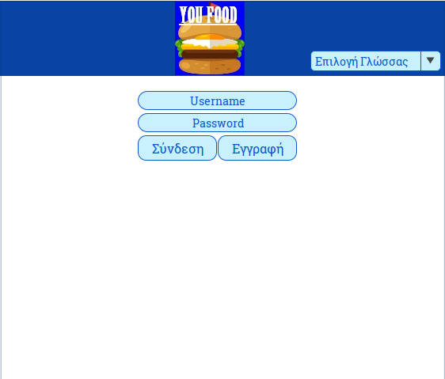
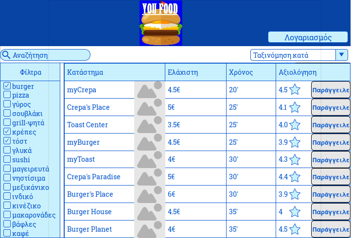
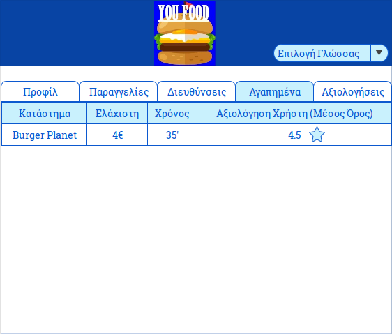
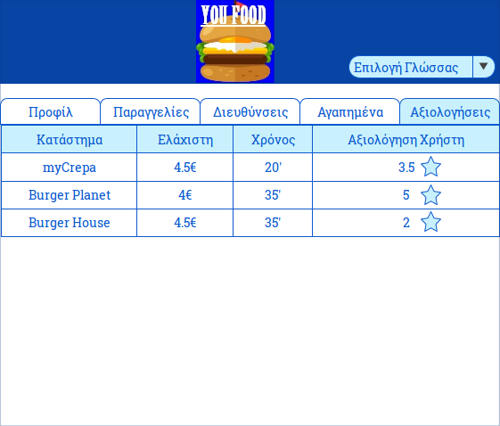
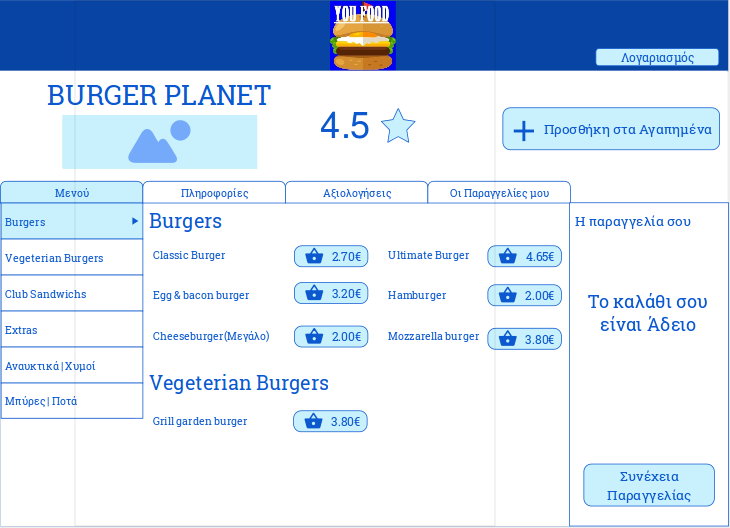
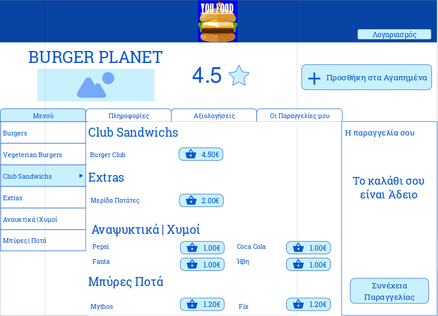
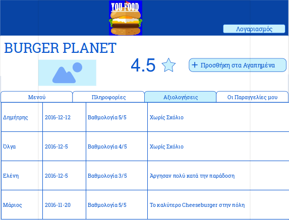
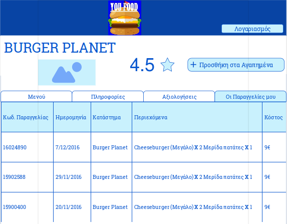
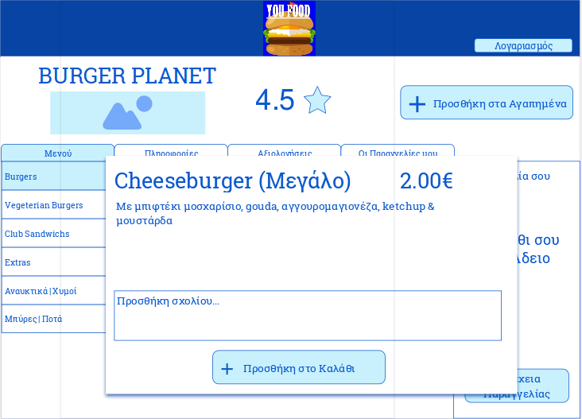
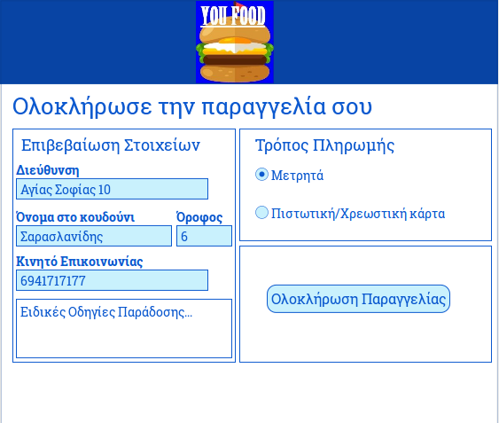

# Storyboard 

##Αρχική Σελίδα

Στην Αρχική Σελίδα ο χρήστης θα μπορεί να συνδεθεί με την υπηρεσία μας ή να κάνει την εγγραφή του εάν είναι νέος χρήστης. Επίσης θα έχει την δυνατότητα επιλογής ανάμεσα στην αγγλική και την ελληνική γλώσσα.

##Βασική Σελίδα

Μόλις συνδεθεί με την υπηρεσία μας ο χρήστης θα μπορεί να περιηγηθεί στην βασική σελίδα. Εδώ θα μπορεί να κάνει αναζήτηση κάποιου συγκεκριμένου καταστήματος που γνωρίζει ή να χρησιμοποιήσει τα φίλτρα των καταστημάτων ανάλογα με την όρεξη του. Θα έχει επίσης την δυνατότητα να ταξινομεί τις επιλεγμένες κατηγορίες καταστημάτων του σύμφωνα με το ελάχιστο κόστος για να πραγματοποιηθεί η παραγγελία, το ελάχιστο χρόνος παράδοσης της παραγγελίας και την αξιολόγηση από τους υπόλοιπους χρήστες που χρησιμοποιούν την υπηρεσία μας. Στην συνέχεια θα μπορεί να προχωρήσει στην καταχώριση μιας παραγγελίας. Τέλος θα έχει την δυνατότητα να συνδεθεί με τον λογαριασμό του και να τροποποιήσει τα στοιχεία του αν το επιθυμεί. 

##Σελίδα Λογαριασμού Χρήστη

Στην Σελίδα Λογαριασμού ο χρήστης θα έχει την δυνατότητα να αλλάξει τα στοιχεία που καταχώρησε αρχικά στο σύστημα. Θα μπορεί επίσης να προτρέξει στις παλιότερες παραγγελίες του για να μπορέσει να δει ποιες ήταν οι προτιμήσεις του. Στην κατηγορία "διευθύνσεις" θα μπορεί να προσθέτει οποιαδήποτε διεύθυνση στην οποία θέλει να γίνει η παράδοση της παραγγελίας του. Όλα τα καταστήματα τα οποία έχει ξεχωρίσει και έχει αποθηκεύσει ο χρήστης βρίσκονται στην κατηγορία "αγαπημένα". Τέλος θα μπορεί να βλέπει και όλες τις αξιολογήσεις που έχει κάνει. 

##Σελίδα Παραγγελίας

Η Σελίδα της παραγγελίας θα είναι ουσιαστικά το προφίλ του καταστήματος που έχει επιλέξει προηγουμένως ο χρήστης. Θα μπορεί λοιπόν να περιηγηθεί στο μενού του καταστήματος, να επιλέξει τα προϊόντα που θέλει και να τα κάνει προσθήκη στο καλάθι. Εάν επιθυμεί να δει το ωράριο του καταστήματος καθώς και την τοποθεσία του τότε θα επιλέξει την κατηγορία "Πληροφορίες". Θα έχει επίσης την δυνατότητα να δει τις αξιολογήσεις άλλων χρηστών καθώς και τις παλιότερες παραγγελίες που έχει κάνει στο συγκεκριμένο κατάστημα, αν υπάρχουν. Κατά την προσθήκη προϊόντων στο καλάθι θα μπορεί επίσης να προσθέτει σχόλια έτσι ώστε να γνωρίζουν στο κατάστημα ακριβώς πως το επιθυμεί το προϊόν ο πελάτης. Μόλις υπάρχουν αρκετά προϊόντα στο καλάθι ο χρήστης θα μπορεί να συνεχίσει την παραγγελία του.

##Σελίδα Ολοκλήρωσης Παραγγελίας

Το τελικό στάδιο είναι η σελίδα ολοκλήρωσης της παραγγελίας όπου γίνεται επιβεβαίωση των στοιχείων του χρήστη καθώς και επιλογή του τρόπου πληρωμής. Αν δεν παρουσιαστεί κάποιο πρόβλημα θα εμφανίζεται ένα μήνυμα επιτυχημένης ολοκλήρωσης της παραγγελίας.

